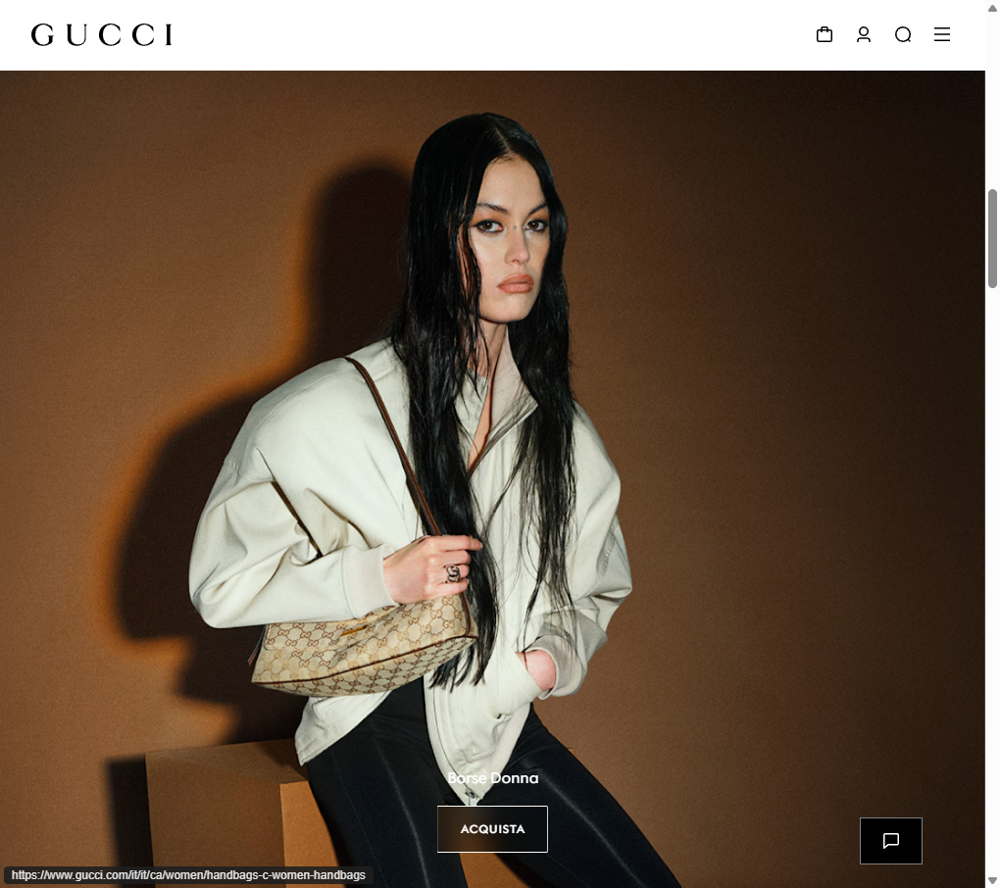
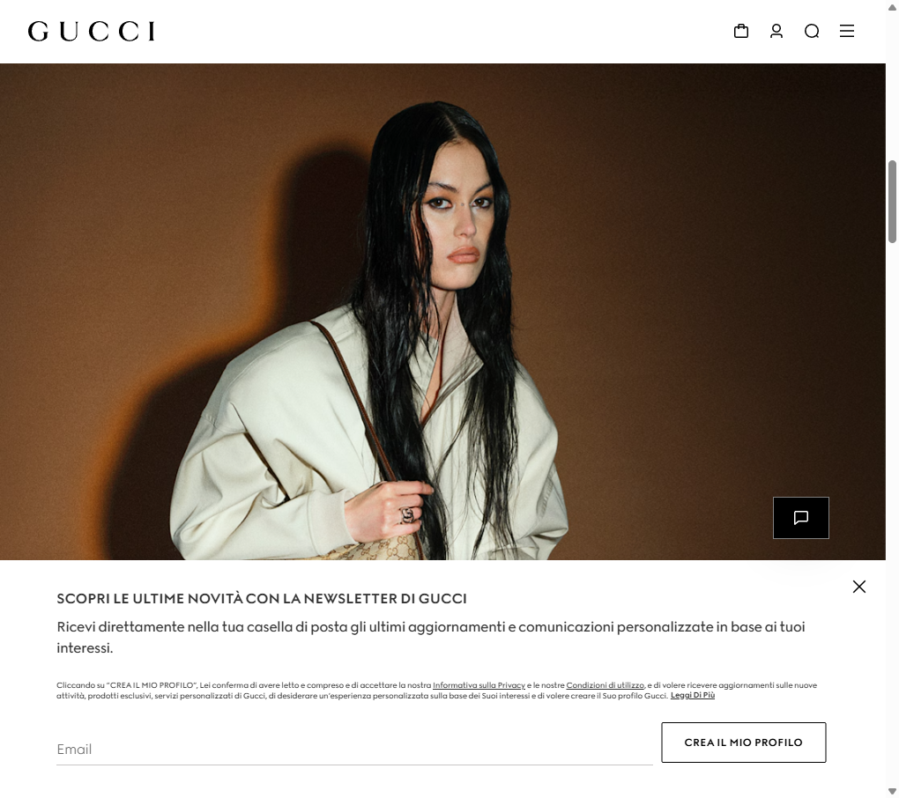
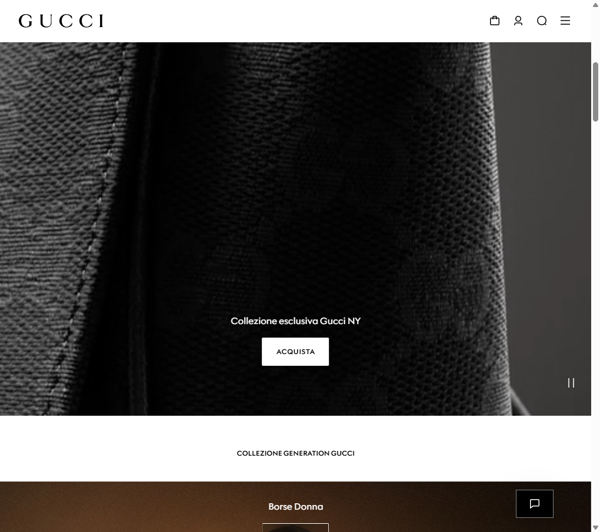
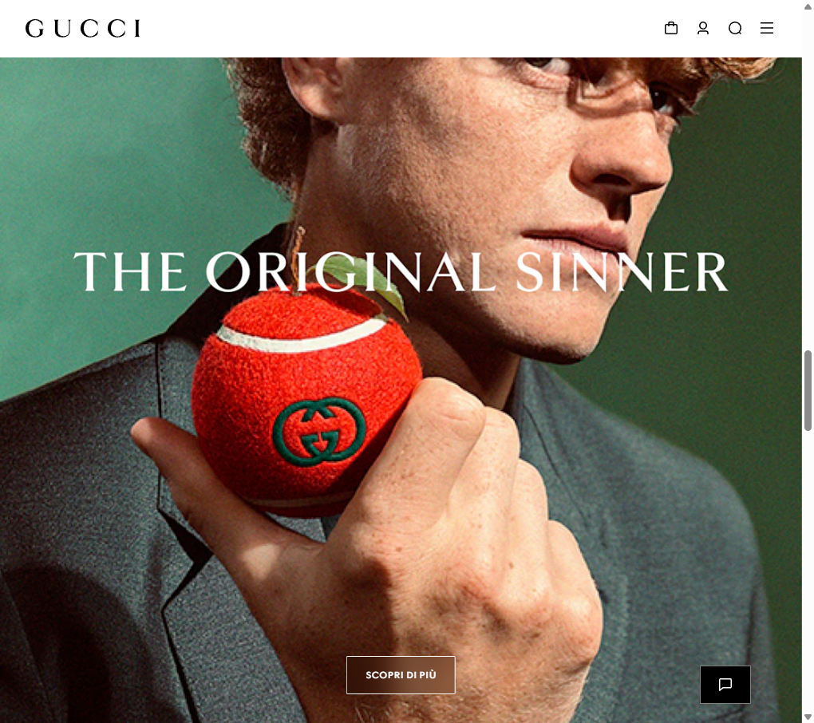

# Gucci.com — Design Reference per Classic Gucci (PrestaShop)

Documento di audit visivo per accelerare lo sviluppo del tema child `classic-gucci`.  
**Benchmark:** [gucci.com/it/it](https://www.gucci.com/it/it/)  
**Staging nostro:** [chocolate-ferret-940937.hostingersite.com](https://chocolate-ferret-940937.hostingersite.com/)

Screenshot salvati in `docs/reference-screenshots/`.

---

## 1. Header (layout reale Gucci)



### Struttura ufficiale (desktop)

| Zona | Contenuto |
|------|-----------|
| **Sinistra** | Logo **GUCCI** (serif, nero, piccolo rispetto alla larghezza pagina) |
| **Destra** | Solo **icone lineari** (nessun testo): carrello → account → cerca → **hamburger menu** |

**Nota importante:** sul sito Gucci **non** c’è il menu orizzontale sempre visibile (Donna, Uomo, Borse…) nella barra header. La navigazione principale è nel **drawer** aperto dall’hamburger.

### Menu drawer



- Lista **verticale** a tutta larghezza
- Voci in sans-serif, maiuscole, spaziatura ampia
- Sottomenu espandibili (accordion)
- In fondo: Ricerca negozio, Login, Contatti, telefono

### Implementazione PrestaShop consigliata

| Elemento | File / hook |
|----------|-------------|
| Logo | `#_desktop_logo` in `header.tpl` — **allineato a sinistra** |
| Icone | `displayNav2`: `ps_searchbar`, `ps_customersignin`, `ps_shoppingcart` |
| Menu | `displayTop` → solo `ps_mainmenu`, dentro drawer `#mobile_top_menu_wrapper` |
| Toggle menu | `#menu-icon` visibile anche su desktop |

**Differenza rispetto al brief iniziale:** il brief chiedeva logo **centrato** e menu a sinistra; Gucci reale usa logo **sinistra** + menu hamburger. Per fedeltà al brand → seguire Gucci reale.

---

## 2. Tipografia

| Uso | Font | Peso | Stile |
|-----|------|------|--------|
| Logo / titoli editoriali | Serif (Gucci custom; noi: **Playfair Display**) | 400 | Spesso maiuscolo, tracking ampio |
| UI, menu drawer, footer, CTA | Sans (**Montserrat**) | 300–400 | Maiuscolo, `letter-spacing: 0.1em–0.2em` |
| Corpo / descrizioni | Sans leggero | 300 | `line-height: 1.7–1.8`, grigio `#666` |

### Scale indicativa

```css
/* Menu / footer labels */
font-size: 11px;
letter-spacing: 0.15em;
text-transform: uppercase;

/* Titolo prodotto (PDP) */
font-family: "Playfair Display", serif;
font-size: 1.5rem–1.75rem;
letter-spacing: 0.04em;
text-transform: uppercase;

/* Prezzo PDP */
font-size: 0.875rem;
font-weight: 300;
color: #111;
```

---

## 3. Colori e UI

| Token | Valore | Uso |
|-------|--------|-----|
| Background | `#FFFFFF` | Body, header, footer |
| Testo primario | `#000000` / `#111111` | Titoli, menu |
| Testo secondario | `#666666` | Link footer, descrizioni |
| Accento | **Nessun blu/teal/arancione** PrestaShop | Eliminare `#24b9d7`, badge arancioni |
| Bordi | `#111` 1px o nessun bordo | Input, bottoni outline |
| Ombre | Nessuna o quasi nulla | Card prodotto, header |

### Bottoni

- **Primario:** rettangolo nero pieno, testo bianco, maiuscolo, tracking largo
- **Secondario / hero:** outline bianco su immagine, sfondo semi-trasparente (vedi hero “ACQUISTA”)

---

## 4. Homepage



### Hero

- **Full-bleed** immagine o video
- Testo **centrato** in basso (sans, bianco, maiuscolo)
- CTA unico: bordo sottile, non bottone Bootstrap colorato
- **Niente** slider con frecce stile Classic / punti blu

### Sezioni sotto hero

- Titoli sezione centrati: `COLLEZIONE GENERATION GUCCI` (sans, piccolo, tracking)
- Blocchi editoriali full-width (immagine + titolo + link)
- Griglia categorie: **2 colonne** su desktop (es. Borse Donna | Borse Mini)

### Cosa nascondere sul nostro staging

- `ps_imageslider` / `#carousel`
- `ps_banner`, `ps_customtext` (o restylare come editoriale)
- `blockreassurance` in home
- Quick view, wishlist heart sulle card

---

## 5. Listing prodotti (PLP)

- Griglia **ampia**, molto whitespace tra le card
- Immagine prodotto: **sfondo bianco**, niente box grigio
- Sotto immagine: **nome prodotto** (sans o serif piccolo), **prezzo** sotto in grigio
- **Niente** badge sconto, -20%, “New”
- **Niente** quick view

---

## 6. Scheda prodotto (PDP)

### Layout

- Immagine grande a sinistra (o full width su mobile)
- Destra: titolo serif, prezzo unico (no barrato colorato, no “Save 20%”)
- Descrizione breve grigia
- Variant selector minimal (taglia, colore)
- Un solo bottone **AGGIUNGI AL CARRELLO** nero, largo
- **Niente** tab Description/Details stile Classic (o tabs sottili uppercase)
- **Niente** blocchi reassurance con icone

### File child già previsti

- `templates/catalog/product.tpl` (extends parent)
- `templates/catalog/_partials/product-prices.tpl`
- `templates/catalog/_partials/product-flags.tpl` (vuoto)
- CSS `#product` in `custom.css`

---

## 7. Footer



### Struttura

1. **Ricerca negozio** (input + submit)
2. **Newsletter** (titolo serif/sans uppercase, input underline, bottone outline)
3. **Accordion** “POSSIAMO AIUTARTI?”, “INFORMAZIONI AZIENDALI”, “SERVIZI ESCLUSIVI”
4. Lingua / Paese
5. Copyright legale piccolo, grigio

### Mapping PrestaShop

| Colonna Gucci | Modulo / contenuto |
|---------------|-------------------|
| Servizio Clienti | `ps_linklist` blocco BO |
| La Nostra Azienda | `ps_linklist` |
| Note Legali | `ps_linklist` |
| Canali / Social | `ps_socialfollow` |

Titoli: 12px uppercase sans, **non** grassetto. Link: 11px, `#666`, `line-height: 2`.

---

## 8. Gap analysis — Staging vs Gucci

| Area | Staging attuale | Target Gucci | Priorità |
|------|-----------------|--------------|----------|
| Header | Menu verticale/orizzontale misto, logo centro, testo “Sign in” | Logo sx, icone dx, hamburger | **Alta** |
| Home | Slider Sample 1/2/3 visibile | Hero editoriale o nascosto | **Alta** |
| Card prodotto | Sfondo grigio, varianti colore | Bianco, minimal | Media |
| PDP | Badge, tab, reassurance | Pulito, prezzo unico | **Alta** |
| Logo | “my store” colorato | Logo monocromatico BO | **Alta** (contenuto) |
| Footer | Colonne Classic | Accordion + newsletter stile | Media |

---

## 9. Roadmap implementazione (ordine)

1. **Header Gucci autentico** — logo sx, drawer menu, icone only  
2. **Home** — nascondere slider + moduli rumorosi  
3. **PLP** — griglia `product.tpl` + CSS (già parzialmente fatto)  
4. **PDP** — rifinire varianti, tabs, add-to-cart  
5. **Footer** — accordion CSS + link list BO  
6. **BO** — logo bianco/nero, disattivare moduli home non necessari  

---

## 10. Checklist QA (ogni deploy)

- [ ] Cache PrestaShop svuotata  
- [ ] Hook: `ps_mainmenu` → displayTop; search/cart/account → displayNav2  
- [ ] Confronto header con `gucci-home-hero.png`  
- [ ] Home senza slider Classic  
- [ ] PDP senza badge -20% / New  
- [ ] Nessun link blu `#24b9d7`  
- [ ] Font Playfair + Montserrat caricati (Network tab / computed style)  

---

## 11. Link utili

- [Gucci IT — Home](https://www.gucci.com/it/it/)
- [Staging Barbara Alvisi](https://chocolate-ferret-940937.hostingersite.com/)
- [PrestaShop Child Themes](https://devdocs.prestashop-project.org/9/themes/create-a-theme/child-theme/)

---

*Ultimo audit: maggio 2026 — screenshot in `docs/reference-screenshots/`.*
