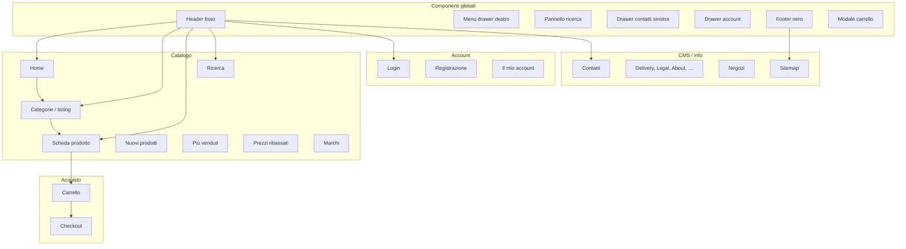

# Audit staging — Mappa sito e allineamento Gucci

**Data audit:** 24 maggio 2026  
**Ultimo pass tema:** v1.6.2 — home ordine editoriale, PLP titoli IT (fix scope Smarty)  
**Staging:** [chocolate-ferret-940937.hostingersite.com](https://chocolate-ferret-940937.hostingersite.com/index.php)  
**Benchmark:** [gucci.com/it/it](https://www.gucci.com/it/it/)  
**Screenshot riferimento:** `docs/reference-screenshots/gucci-*.png`  
**Tema child:** `classic-gucci`

Metodo: navigazione live (desktop ~1440px e mobile 390px), confronto con `GUCCI-DESIGN-REFERENCE.md` e screenshot Gucci locali.

---

## Legenda stato

| Simbolo | Significato |
|---------|-------------|
| ✅ | Allineato o accettabile rispetto al target Gucci |
| 🟡 | Parziale — funziona ma distante dal reference |
| ❌ | Non allineato / Classic o demo ancora visibile |
| 🔧 | Dipende da back office (contenuti, moduli, logo, lingue) |
| ⏳ | Non verificato live in questa sessione (solo da codice / sitemap) |

---

## 1. Mappa del sito

### 1.1 URL principali (id_lang=1)

| Area | URL / controller | Note |
|------|------------------|------|
| **Home** | `/index.php` | Hook: slider → featured (Selezione) → banner → Esplora (tpl) |
| **Categoria** | `?id_category=3&controller=category` (Clothes) | Sottocategorie: Men, Women |
| **Categoria** | `id_category` Accessories, Art, Stationery, Home Accessories | Da menu / sitemap |
| **Prodotto** | `?id_product=1&controller=product` (es. Hummingbird t-shirt) | Varianti size/colore |
| **Prodotto** | `?id_product=20` (Barbara Alvisi Product) | Prezzo alto, immagini lifestyle |
| **Ricerca** | `?controller=search` | Titolo «Risultati per …» IT |
| **Nuovi** | `?controller=new-products` | ✅ Titolo IT + griglia Gucci |
| **Best sellers** | `?controller=best-sales` | ✅ Titolo IT |
| **Offerte** | `?controller=prices-drop` | ✅ Titolo IT |
| **Marchi** | `?controller=manufacturer` | ✅ Listing marca + pagina Marchi |
| **Carrello** | `?controller=cart` | |
| **Checkout** | `?controller=order` | ⏳ (richiede articoli in carrello) |
| **Login** | `?controller=authentication` | |
| **Registrazione** | `?controller=registration` | ⏳ |
| **Account** | `?controller=my-account` | ⏳ |
| **Contatti** | `?controller=contact` | Form Classic |
| **Negozi** | `?controller=stores` | ⏳ |
| **Sitemap** | `?controller=sitemap` | Elenco completo link |
| **CMS** | Delivery, Legal Notice, Terms, About us, Secure payment | Da footer |

### 1.2 Moduli home attivi (`theme.yml`)

Ordine hook `displayHome`: `ps_imageslider` → `ps_featuredproducts` → `ps_banner`. Sezione **Esplora** via `gucci-home-categories.tpl` in `index.tpl`.

Override vuoti: `ps_specials`, `ps_newproducts`, `ps_bestsellers`, `ps_customtext` (no output).

**Residuo BO:** 🔧 immagini slider demo; 🔧 cover `cat-3/6/9.jpg` in `assets/img/home/`; banner opzionale.

---

## 2. Componenti globali

| Componente | Stato | Leggibilità / margini | vs Gucci (`gucci-menu-drawer.png`, `gucci-footer.png`, `gucci-home-hero.png`) |
|------------|-------|------------------------|----------------------------------------------------------------------------------|
| **Header — struttura** | 🟡 | Logo sx, icone dx; altezza ok | ✅ Layout iconico simile; ❌ logo ancora demo “my store” colorato (EN) / da verificare logo BO IT |
| **Header — visibilità su hero** | 🟡 | Icone bianche su slider; contrasto variabile sulle slide chiare | Gucci: header trasparente con logo/icone sempre leggibili |
| **Header — PDP** | ✅ | Trasparente su galleria, bianco allo scroll | Allineato al pattern overlay |
| **Icone header** | 🟡 | Carrello, account, cerca, menu presenti | Gucci: solo icone, no testo “Sign in” in barra — verificare se compare label |
| **Menu drawer** | 🟡 | Drawer destro, voci Clothes/Accessories/Art, Contatti + Sign in in fondo | Ref: voci uppercase ampie, accordion pulito; 🟡 chevron Material, spacing ok |
| **Pannello ricerca** | ⏳ | — | Gucci: overlay full-screen minimale |
| **Drawer contatti** | 🟡 | Sinistra (scelta progetto) | Non su gucci.com nella stessa forma |
| **Footer — sfondo** | ✅ | Nero, testo bianco | ✅ |
| **Footer — colonne** | ✅ | Accordion mobile; link IT via `linkblock.tpl` | Prodotti / La nostra azienda in IT |
| **Footer — newsletter** | ✅ | Widget in `footer.tpl` v1.3.8+ | Input underline, IT |
| **Footer — lingua/paese** | 🟡 | Widget `ps_languageselector` / `ps_currencyselector` in meta row | Visibile se >1 lingua/valuta in BO |
| **Footer — social** | 🟡 | Widget `ps_socialfollow` | 🔧 configurare link in modulo Social follow |
| **Modale carrello** | 🟡 | Slide da destra | 🟡 transizione migliorata in codice; da verificare con prodotto in carrello |
| **Wishlist (modulo)** | 🟡 | Nascosta via CSS/JS + hook vuoti | 🔧 disattivare `blockwishlist` in BO |
| **Tipografia globale** | 🟡 | Playfair + Montserrat caricate | Mix pesi/scale tra pagine; body ancora “Classic” su form/CMS |
| **Colori PrestaShop** | 🟡 | Catalogo pulito | ❌ possibili residui blu su pagine non override (contact, auth) |

---

## 3. Audit per pagina

### 3.1 Home — `index.php`

| Criterio | Stato | Note |
|----------|-------|------|
| Hero full-bleed editoriale | 🟡 | Slider Sample — layout hero Gucci ok; 🔧 sostituire immagini BO |
| Una sola griglia prodotti | ✅ | Solo `ps_featuredproducts` (“Selezione”) in `theme.yml` |
| Blocco editoriale / 2 colonne categorie | 🟡 | `gucci-home-categories.tpl` — Abbigliamento / Accessori / Arte |
| Custom text Lorem | ✅ | Modulo `ps_customtext` override vuoto |
| Card prodotto | 🟡 | Griglia ok; sfondo grigio immagine demo |
| Margini sezioni | 🟡 | Troppo contenuto verticale; poco respiro tra slider e prima griglia |
| Header su home | 🟡 | Sovrapposto allo slider; logo/icona leggibilità dipende da slide |
| Footer | 🟡 | Coerente col resto sito |

**Mobile 390px:** slider full width ok; griglia prodotti 1 colonna; header icon-only più pulito; stessi problemi contenuti demo.

**Priorità:** Fase 3 roadmap — BO disattivare moduli extra; hero/banner editoriali; rimuovere Lorem.

---

### 3.2 Listing categoria — `category` (es. Clothes)

| Criterio | Stato | Note |
|----------|-------|------|
| Layout full width | ✅ | Griglia 3 prodotti, aria laterale |
| Titolo categoria | 🟡 | “Clothes” centrato; ref Gucci più discreto / allineato sx |
| Descrizione categoria | ✅ | Nascosta in v1.3.9 (`product_list_footer` vuoto + CSS) |
| Toolbar (conteggio, filtri, ordina) | 🟡 | “3 products”, Filter, Sort presenti | Gucci: toolbar minimal caption |
| Filtri | 🟡 | Drawer + filtri in pagina (DOM ricco) | Verificare che sidebar Classic non sporga |
| Card prodotto | 🟡 | Nome + prezzo ok; immagine lifestyle vs packshot misti |
| Breadcrumb | 🟡 | Presente, stile Classic |
| Badge sconto / New | ✅ | Nascosti in card override |
| Header | ✅ | Bianco, leggibile |
| Margini | 🟡 | Header categoria e griglia ok; descrizione appesantisce |

**URL test:** [Clothes](https://chocolate-ferret-940937.hostingersite.com/index.php?id_category=3&controller=category&id_lang=1)

---

### 3.3 Listing speciali — new-products, best-sales, prices-drop

| Criterio | Stato | Note |
|----------|-------|------|
| Griglia prodotti | 🟡 | Stesso stile PLP (verificato su **New products**) |
| Filtri | 🟡 | Lista filtri estesa come categoria |
| Titolo pagina | 🟡 | Standard PrestaShop |
| ⏳ best-sales / prices-drop | ⏳ | Stessa famiglia template listing |

---

### 3.4 Scheda prodotto — `product`

| Criterio | Stato | Note |
|----------|-------|------|
| Galleria full-bleed | ✅ | Immagine hero ampia; counter 1/n; thumbs |
| Header overlay | ✅ | Trasparente su gallery, leggibile |
| Layout 2 colonne desktop | ✅ | Buybox sx + descrizione/accordion dx (ref. `gucci-pdp-desktop-1440-*.png`) |
| Tipografia titolo/prezzo | ✅ | Serif uppercase + prezzo sobrio |
| Varianti taglia/colore | 🟡 | Chip con **bordo nero** su selezionato — da ammorbidire se si vuole zero “box” |
| CTA Add to cart | ✅ | Nero, full width |
| Note spedizione + Contact us | 🟡 | Presenti; spacing migliorato di recente |
| Gucci services / Find store / Appointment | ✅ | **Rimossi** su richiesta |
| Descrizione + accordion | ✅ | Product Details, Material care, Our commitment |
| Animazione accordion | 🟡 | Fluida su PDP; focus trigger ok |
| Tab / reassurance Classic | ✅ | Nascosti |
| Accessori | ⏳ | Sezione “You might also like” se prodotti collegati in BO |
| Margini buybox | 🟡 | Migliorati; ancora da confrontare con `gucci-pdp-gossip-buybox.png` |

**URL test:** [Hummingbird t-shirt](https://chocolate-ferret-940937.hostingersite.com/index.php?id_product=1&id_product_attribute=1&rewrite=hummingbird-printed-t-shirt&controller=product&id_lang=1)

---

### 3.5 Ricerca — `search`

| Criterio | Stato | Note |
|----------|-------|------|
| Risultati PLP | ⏳ | Template `search.tpl` in child |
| Pannello ricerca header | ⏳ | Overlay full screen da verificare |

---

### 3.6 Carrello — `cart`

| Criterio | Stato | Note |
|----------|-------|------|
| Layout minimal | 🟡 | Wrapper Gucci; contenuto parent Classic |
| Carrello vuoto | 🟡 | Messaggio + Continue shopping; breadcrumb |
| Tabella prodotti (con items) | ⏳ | Da testare dopo add-to-cart |
| Header / footer | ✅ / 🟡 | Standard sito |

---

### 3.7 Checkout — `order`

| Criterio | Stato | Note |
|----------|-------|------|
| Step colorati Classic | ❌ | Solo wrapper CSS — override partials mancanti |
| Form / riepilogo | ⏳ | |

---

### 3.8 Login / Registrazione — `authentication`, `registration`

| Criterio | Stato | Note |
|----------|-------|------|
| Layout centrato | 🟡 | Titolo H1 uppercase |
| Campi form | ❌ | Input **box grigio Classic**, bottone SHOW nero — non underline Gucci |
| Breadcrumb | 🟡 | HOME / LOG IN… |
| Link secondari | 🟡 | Sottolineati ok |

---

### 3.9 Il mio account — `my-account`

| Criterio | Stato | Note |
|----------|-------|------|
| Dashboard link | ⏳ | Template child presente, stile parziale |

---

### 3.10 Contatti — `contact`

| Criterio | Stato | Note |
|----------|-------|------|
| Layout | ❌ | **layout-left-column** — possibile colonna vuota / asimmetria |
| Form | ❌ | Select, file, textarea **stile Classic** |
| Info negozio | 🟡 | Email visibile |
| Margini | 🟡 | Form stretto, poco lusso |

---

### 3.11 Pagine CMS — Delivery, Legal, About, …

| Criterio | Stato | Note |
|----------|-------|------|
| Tipografia corpo | ⏳ | Probabile stile parent |
| Larghezza contenuto | ⏳ | |
| Header/footer | 🟡 | Globali ok |

---

### 3.12 Sitemap — `sitemap`

| Criterio | Stato | Note |
|----------|-------|------|
| Utilità | ✅ | Mappa link completa |
| Stile | ❌ | Lista link Classic, colonne strette |
| Margini | 🟡 | Denso, poco editoriale |

---

### 3.13 Negozi — `stores`

| Criterio | Stato | Note |
|----------|-------|------|
| ⏳ | ⏳ | Non visitato |

---

## 4. Riepilogo gap vs screenshot Gucci

| Screenshot reference | Cosa manca sullo staging |
|---------------------|---------------------------|
| `gucci-home-hero.png` | Hero video/immagine unica + copy bianco + CTA outline; niente slider Sample |
| `gucci-home-categories.png` | Sezione 2 colonne categorie editoriali |
| `gucci-menu-drawer.png` | Voci più “luxury” (tracking, niente chevron pesante); telefono / store locator in fondo |
| `gucci-footer.png` | Titoli colonne IT Gucci; riga lingua/paese; social minimal |
| `gucci-pdp-desktop-1440-top.png` | Galleria verticale multi-immagine scroll (opzionale); buybox sticky desktop (scelta progetto: buybox sotto gallery) |
| `gucci-pdp-gossip-buybox.png` | Micro-spaziature CTA / varianti da rifinire |
| `gucci-plp` (implicito) | Niente descrizione lunga categoria; filtri più invisibili fino al click |

---

## 5. Matrice priorità interventi

### Priorità alta (impatto visivo immediato)

1. 🔧 **Logo monocromatico** “Barbara Alvisi” in BO (sostituire “my store” demo).
2. 🔧 **Home BO:** disattivare `ps_specials`, `ps_newproducts`, `ps_bestsellers`, `ps_customtext` (o svuotare); tenere 1 hero + 1 featured max.
3. ❌ **Hero home:** sostituire slide Sample con immagini editoriali; CTA outline (non slider demo).
4. ❌ **Rimuovere Lorem** Custom Text Block.
5. 🔧 **Titoli footer** link list in italiano stile Gucci (vedi `bo-recommendations.json`).

### Priorità media

6. 🟡 **PLP:** nascondere o accorciare descrizione categoria; breadcrumb minimal.
7. 🟡 **Contact + Auth:** override form underline, full width, no box grigi.
8. ❌ **Wishlist:** disattivare modulo o nascondere modali placeholder `((modalTitle))`.
9. 🟡 **Varianti PDP:** bordo selezione taglia più discreto (1px / solo underline).
10. 🟡 **Lingua:** allineare IT come default e stringhe header (“Accedi” vs “Sign in”).

### Priorità bassa / dopo catalogo

11. ⏳ **Checkout** override step e form.
12. ⏳ **Sitemap / CMS** stile editoriale.
13. ⏳ **Ricerca** overlay e risultati.
14. 🔧 **Social** footer + riga paese/lingua stile Gucci.

---

## 6. Stato complessivo per area

| Area | Stato | Commento breve |
|------|-------|----------------|
| Header + drawer | 🟡 | Struttura Gucci ok; logo e dettagli UI da rifinire |
| Home | ❌ | Ancora demo PrestaShop multi-blocco |
| PLP | 🟡 | Griglia buona; testi e filtri da pulire |
| PDP | ✅ / 🟡 | Miglior pagina del sito; rifiniture varianti/margini |
| Footer | 🟡 | Nero ok; contenuti e lingua da BO |
| Carrello / checkout | ❌ / ⏳ | Quasi tutto parent Classic |
| Account / contact | ❌ | Form e layout non luxury |
| Global / moduli | 🟡 | Wishlist e moduli home rumorosi |

**Voto sintetico allineamento Gucci (staging attuale):** ~**45%** — forte sul PDP e header structure; debole su home, funnel acquisto e pagine servizio.

---

## 7. Checklist verifica post-intervento

Dopo ogni deploy su Hostinger:

- [ ] Home: 1 hero + max 1 griglia prodotti, zero Lorem
- [ ] Logo reale visibile IT e EN
- [ ] PDP: nessun blocco servizi rimosso, accordion fluidi
- [ ] PLP: no muro di testo sotto titolo categoria
- [ ] Footer: titoli IT, nessun `((modalTitle))` in pagina
- [ ] Auth/Contact: input underline, no box grigio
- [ ] Confronto screenshot side-by-side con `docs/reference-screenshots/gucci-*.png`

---

## 8. Documenti correlati

- `docs/GUCCI-DESIGN-REFERENCE.md` — token e pattern target
- `docs/GUCCI-ALIGNMENT-AUDIT.md` — roadmap per fasi e file da toccare
- `.cursor/rules/prestashop-gucci-child-theme.mdc` — regole deploy e **scope per componente**

---

*Audit generato da navigazione live dello staging. Aggiornare dopo ogni sprint deploy.*
